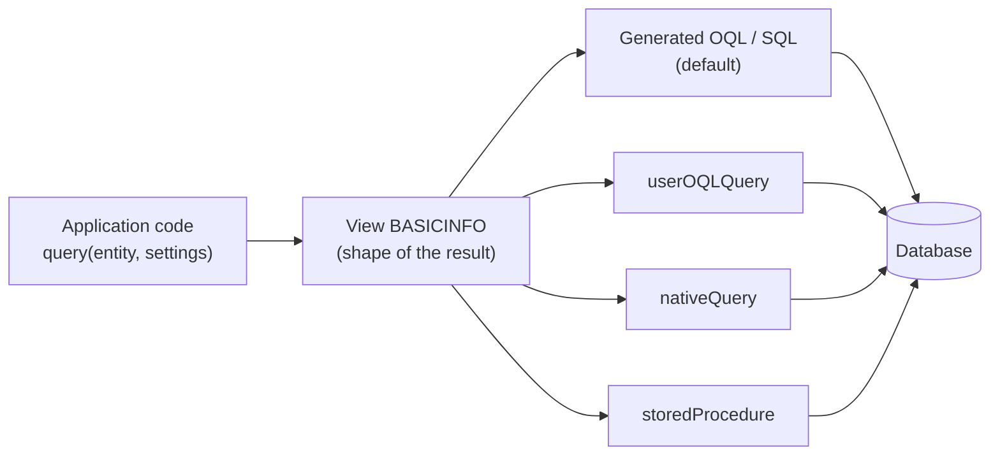

# XOR documentation

XOR is a Java library that sits between your application and its persistence layer (JPA or plain JDBC). It
provides create, read, update, delete and query (CRUDQ) operations on whole aggregates, transforms data
between an external model (JSON, DTOs, an OpenAPI schema) and the domain model, and generates, imports and
exports test data.

## The core idea

A **view** is the contract for the *shape* of the data: a named list of attribute paths such as `name`,
`taskChildren.name` or `taskChildren.[BASICINFO]`. Application code asks for a view by name and gets back
objects of exactly that shape.

*How* the view is filled is a separate, swappable decision. By default XOR generates the queries from the
ORM mapping. When a query needs tuning, a DBA can replace it in `AggregateViews.xml` with a hand-written
OQL (JPQL) query, a native SQL query or a stored procedure. The application code does not change.



The four boxes on the right are interchangeable. Each produces the same shape, so the query can be swapped
in configuration without touching code.

## Features

| Area | What XOR provides |
| --- | --- |
| Aggregate operations | `create`, `read`, `update`, `delete`, `clone`, `query`, `patch` on an entity and everything it owns, in one call, with save and delete order worked out from the model |
| Views | Built-in views per entity, custom views in XML or code, regular expression attributes, view references and composition |
| Query engine | Turns a view into a tree of queries, splits Cartesian products into separate queries, joins parent and child queries with IN lists or a temp table, runs them serially or in parallel, and rebuilds the object graph |
| Query tuning | Replace any view's query with user OQL, native SQL or a stored procedure. Columns are mapped by position or by alias |
| Model transformation | `TypeMapper` implementations for JSON (`org.json` and Jakarta JSON-P), DTO/VO classes, and domain classes |
| Multiple models | JPA metadata, a JDBC catalog, or an OpenAPI style JSON schema as the type system |
| Data generation | Per-field generators, collection sparseness, subtype selection, domain values from Excel, CSV bulk loading |
| Import and export | Aggregates to and from Excel and CSV |
| Introspection | Meta API, type graphs and object graphs as PNG, DOT or GML |

## Requirements

* Java 17 or later
* Jakarta Persistence 3.2 (`jakarta.persistence`). The test suite runs against Hibernate ORM 7.4 and
  Spring Framework 7.0.
* Applications that use the `javax.persistence` namespace need to migrate to `jakarta.persistence` first.

## Contents

| Page | Covers |
| --- | --- |
| [Getting started](getting-started.md) | Maven dependency, Spring configuration, a first create and query |
| [Architecture](architecture.md) | Models, shapes, type mappers, data models and stores, the request flow |
| [Views](views.md) | Built-in and custom views, references, how a view becomes queries, joins, dispatch and reconstitution |
| [Custom queries and tuning](query-tuning.md) | `userOQLQuery`, `nativeQuery`, `storedProcedure`, parameters, paging, column mapping |
| [Operations](operations.md) | Create, update, read, query, delete and the other operations, with examples |
| [Data generation](data-generation.md) | Generators, domain values, sparseness, CSV loader, writing a custom generator |
| [Import and export](import-export.md) | Excel and CSV formats and APIs |
| [Meta API](meta-api.md) | Inspecting types, views and aggregates at runtime |
| [Visualization](visualization.md) | Type graphs, object graphs and query trees as images |
| [Development](development.md) | Building XOR and running the tests |

## A first look

A view, defined once in `AggregateViews.xml` on the classpath:

```xml
<AggregateViews>
    <aggregateView>
        <name>VERYBASIC</name>
        <attributeList>id</attributeList>
        <attributeList>name</attributeList>
        <attributeList>displayName</attributeList>
        <attributeList>description</attributeList>
    </aggregateView>
    <aggregateView>
        <name>BASICINFO</name>
        <attributeList>[VERYBASIC]</attributeList>
        <attributeList>iconUrl</attributeList>
        <attributeList>detailedDescription</attributeList>
    </aggregateView>
</AggregateViews>
```

Code that uses it:

```java
Settings settings = new Settings();
settings.setView(aggregateManager.getView("BASICINFO"));
List<?> people = aggregateManager.query(person, settings);
```

If that query becomes slow, the view can be given a native query in XML (see
[BASICINFO_NATIVE](query-tuning.md#native-sql)) and the Java code above stays the same.

Next: [Getting started](getting-started.md)
