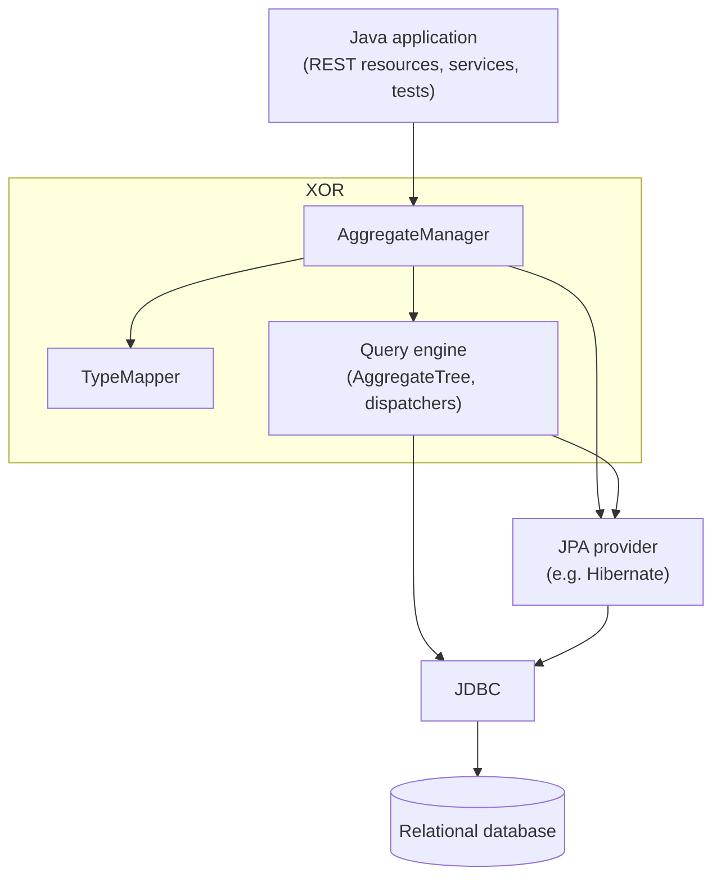
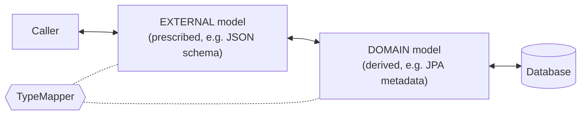
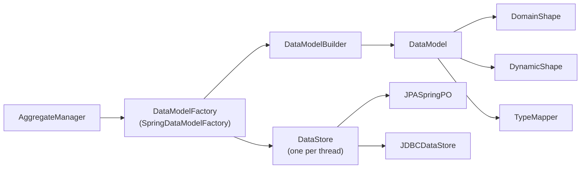
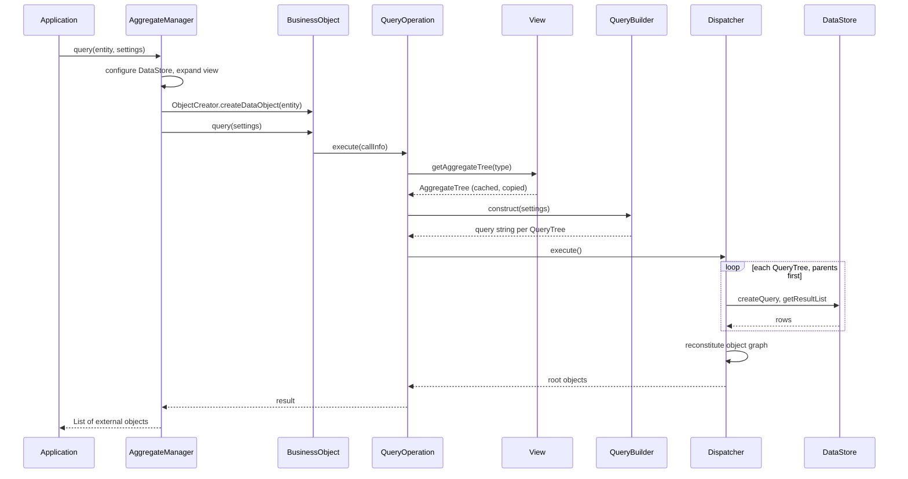
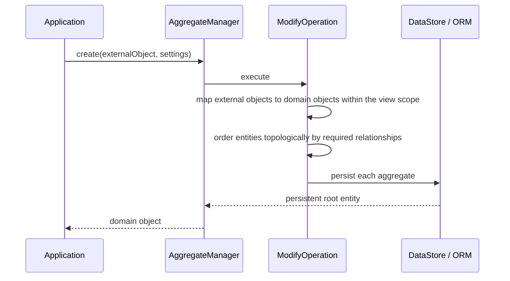
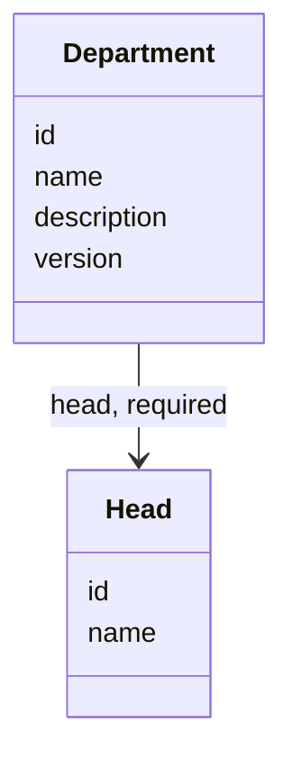

# Architecture

XOR is a layer between application code and the persistence layer. It works with three models of the same
data, describes all of them with one type system, and executes every operation against an aggregate whose
scope is set by a [view](views.md). This page explains the main parts and how a request flows through them.

## Where XOR sits



XOR can be added to a single slow use case first. The rest of the application keeps using JPA directly.

## Three models

An application typically deals with three representations of the same data:

| Model | Example | Role in XOR |
| --- | --- | --- |
| External (UI or API) | JSON, DTOs, an OpenAPI `components/schemas` document | What callers send and receive |
| Domain | JPA entities with their business logic | What is persisted through the ORM |
| Database | Tables and foreign keys | What the queries run against |

XOR maps between them so that callers never need the domain classes, and ORM details such as lazy loading
do not leak into the API. The view decides which part of the object graph is transferred, so everything a
caller needs is fetched while the session is still open.



A model is either *prescribed* (written by the user, e.g. an OpenAPI document) or *derived* (read from
another source, e.g. the JPA metamodel or the JDBC catalog). XOR treats both the same way.

## Type system: shapes, types and properties

Every model is described with the same interfaces:

| Concept | Main classes | Description |
| --- | --- | --- |
| Type | `Type`, `EntityType`, `SimpleType` subclasses, `JPAType`, `JDBCType`, `ExternalType` | An entity or a value type |
| Property | `Property`, `ExtendedProperty`, `JPAProperty`, `JDBCProperty`, `ExternalProperty` | An attribute or a relationship. `ExtendedProperty` also carries data [generators](data-generation.md) |
| Shape | `Shape`, `DomainShape`, `DynamicShape` | A named set of types and views |

The `Shape` javadoc summarizes the implementations: a `DomainShape` holds the types published by the ORM or
the tables of a database, and a `DynamicShape` holds types that are declared, for example from a
`swagger.json`-style document or derived from a domain shape through a `TypeMapper`. Views are registered
in a shape, so `shape.getView("BASICINFO")` and `shape.getType(Task.class)` work the same way for every
model.

## TypeMapper

A `TypeMapper` (`tools.xor.TypeMapper`) converts type names and objects between the two sides of a
transformation, identified by `MapperSide`:

* `EXTERNAL`: the model the caller works with
* `DOMAIN`: the model that is persisted

`AggregateManager` picks the side from the input object. Domain objects in, domain-side processing; external
objects in, external-side processing. `typeMapper.newInstance(MapperSide side)` creates a mapper for one
side.

Built-in type mappers:

| Class | External model |
| --- | --- |
| `DefaultTypeMapper` | The domain classes themselves. External and domain are the same type system |
| `DTOTypeMapper` | Value object classes named after the domain class with the suffix `VO`, e.g. `Address` and `AddressVO` |
| `MutableJsonTypeMapper` | `org.json.JSONObject` |
| `ExcelJsonTypeMapper` | Like `MutableJsonTypeMapper`, plus type and identity metadata (`XOR.type`, `XOR.id`) in each object so shared and cyclic references survive |
| `ImmutableJsonTypeMapper` | Jakarta JSON Processing (`jakarta.json.JsonObject`) |
| `UnchangedTypeMapper` | The same types as the domain shape. Used with the JDBC and OpenAPI models, whose entities are represented as JSON objects |
| `GraphQLTypeMapper` | A `MutableJsonTypeMapper` variant used by the GraphQL support |

You can implement your own by extending `AbstractTypeMapper`. For queries the mapping is usually given in
XML instead: the view lists the attribute paths and the query that fills them.

## Data models and data stores

Two abstractions separate *what the types are* from *how a session talks to the database*:

| Abstraction | Responsibility |
| --- | --- |
| `DataModel` | Owns the shapes and the `TypeMapper`, builds types from a source, loads [generators](data-generation.md) (`initGenerators`), creates `Settings` with `settings()` |
| `DataStore` | A session against the database: persist, load, flush, create and run queries, fill the query join table |
| `DataModelFactory` | Creates the `DataModel` (with a `DataModelBuilder`) and the per-thread `DataStore` |

Available providers:

| Builder (configured on `SpringDataModelFactory`) | `DataModel` | `DataStore` |
| --- | --- | --- |
| `JPASpringDataModelBuilder` | `JPASpringDataModel` | `JPASpringPO` (Spring managed `EntityManager`) |
| `JPAXMLDataModelBuilder` | `JPAXmlDataModel` | `JPAPersistenceXMLPO` (`persistence.xml`) |
| `JDBCSpringDataModelBuilder` | `JDBCSpringDataModel` | `JDBCDataStore` |
| `JDBCConfigDataModelBuilder` | `JDBCConfigDataModel` | `JDBCDataStore` |
| `SwaggerSpringDataModelBuilder` | `SwaggerSpringDataModel` | from the configured `persistenceProvider` |

Besides `SpringDataModelFactory` there are `DefaultDataModelFactory` and `CDIDataModelFactory`. JDBC
support lives in `tools.xor.providers.jdbc`, including SQL dialect translators for HSQLDB, H2, PostgreSQL
and SAP HANA (`HSQLTranslator`, `H2Translator`, `PGTranslator`, `HANATranslator`).



## AggregateManager and operations

`tools.xor.service.AggregateManager` implements the `Xor` interface and is the single entry point. Every
call takes the input object and a `Settings` object that carries the view, the entity type, parameters,
paging and flags.

| Method | Executed by |
| --- | --- |
| `create`, `update` | `ModifyOperation` |
| `delete` | `DeleteOperation` |
| `clone` | `CloneOperation` |
| `read`, `toExternal` | `ReadOperation`, which walks a loaded object graph |
| `query` | `QueryOperation`, which compiles the view into queries (or `DenormalizedQueryOperation` for flat results) |
| `migrate` | `MigrateOperation`, copies entities between two data stores |
| `patch`, `dml`, `toDomain` | Bulk field updates, raw DML, conversion without database access |

See [Operations](operations.md) for usage.

A view is interpreted in two ways, depending on the operation:

* **Traversal** (`create`, `update`, `read`, `delete`, `clone`): the view is turned into a type graph
  (`StateGraph`) and the object graph is walked within that scope.
* **Query** (`query`): the view is turned into an `AggregateTree` of queries. See
  [Views](views.md#from-view-to-sql).

## Request flow of a query



`ClassUtil.doParallelDispatch()` decides between `ParallelDispatcher` and `SerialDispatcher`. Both are
described in [Views](views.md#serial-and-parallel-dispatch).

## Request flow of a create or update



## Aggregates and scope

Java models inheritance and association directly, but aggregation and composition only exist in the
business logic. JPA expresses composition through `cascade`. XOR uses these composition relationships to
define an **aggregate**: an entity together with every object that is deleted with it.

| Scope | Description |
| --- | --- |
| Basic | The simple properties of the entity. No relationships are followed |
| Aggregate | The entity and all its dependent objects, through inheritance and composition |
| Custom | A slice of the aggregate, possibly extended with association relationships. Defined by a view |

Built-in views exist for the basic and aggregate scopes. The scope of an aggregate can be inspected by
generating its [type graph](visualization.md).

## Saving in dependency order

XOR sorts the entity types topologically, so saves and deletes happen in a valid order without code
ordering the `persist` calls. In this model `head` is a required relationship:



With plain JPA, `Head` must be persisted before `Department`:

```java
Head h = new Head();
h.setName("Isaac Newton");
entityManager.persist(h);

Department d = new Department();
d.setName("Mathematics");
d.setHead(h);
entityManager.persist(d);
```

With XOR it is one call. From `JPAMappedByTest.saveRequired`:

```java
Head h = new Head();
h.setName("Isaac Newton");

Department d = new Department();
d.setName("Mathematics");
d.setHead(h);

DataModel das = aggregateManager.getDataModel();
Settings settings = das.settings().base(Department.class)
    .expand(new AssociationSetting(Head.class))
    .build();

aggregateManager.create(d, settings);
```

`expand(new AssociationSetting(Head.class))` adds the `head` association to the scope. Without it only the
`Department` aggregate would be processed.

Previous: [Getting started](getting-started.md) | Next: [Views](views.md)
