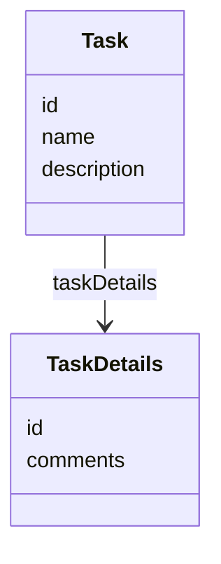
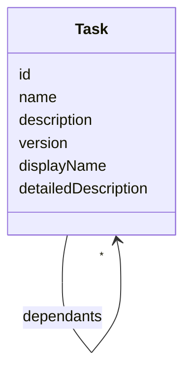
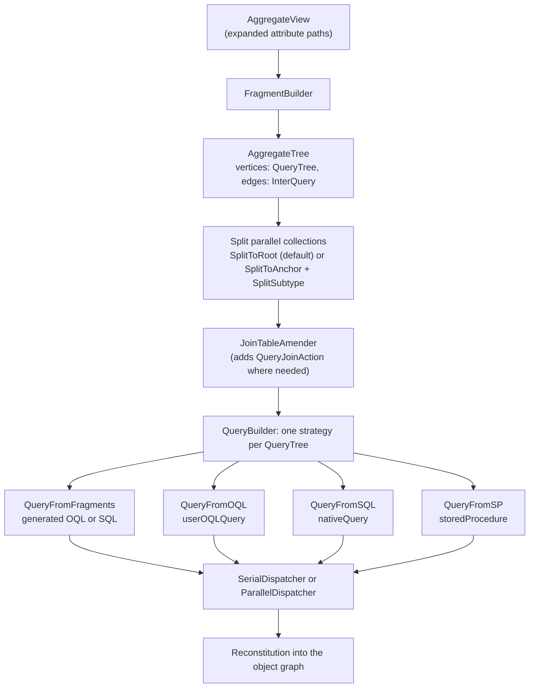
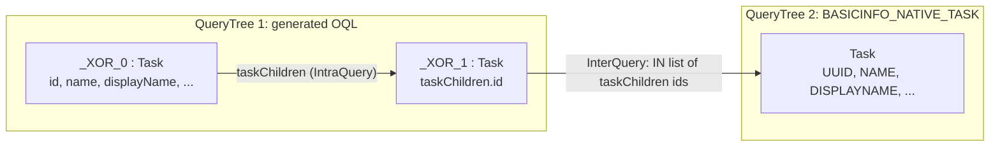
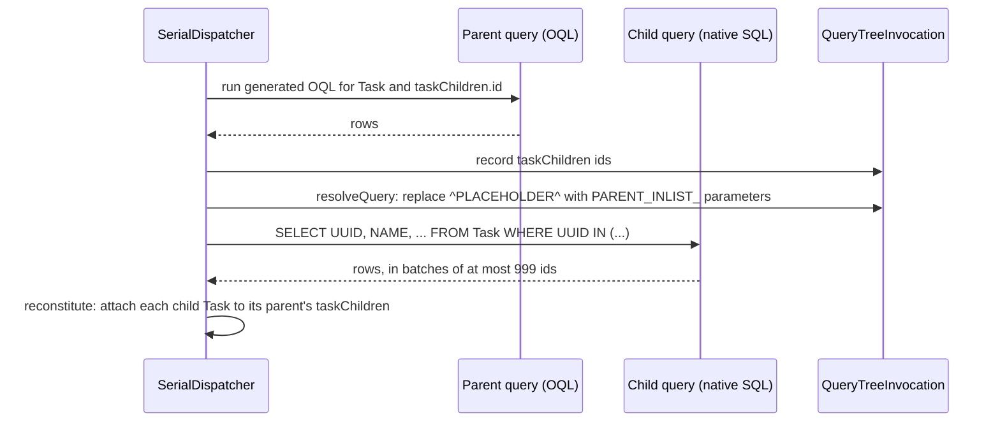

# Views

A view is the contract for the shape of the data an operation works on. It names a set of attribute paths
rooted at an entity type. The same view is used to read, query, create and update, so the code that consumes
the data and the code that fetches it agree on one definition.

This page covers how views are defined, and how XOR turns a view into queries, joins their results and
rebuilds the object graph. [Custom queries and tuning](query-tuning.md) covers replacing the generated
queries with your own.

## Built-in views

Every entity type gets two views generated from the model:

| Shape method | Scope |
| --- | --- |
| `getBaseView(EntityType)` | The simple attributes of the entity. Relationships are not followed |
| `getView(EntityType)` | The whole aggregate: the entity and everything it owns through composition. Associations to other aggregates are not followed |

```java
Shape shape = aggregateManager.getDataModel().getShape();
EntityType personType = (EntityType) shape.getType(Person.class);

View basic = shape.getBaseView(personType);
View aggregate = shape.getView(personType);
```

`Settings` builders select them too: `das.settings().base(Department.class)` uses the base view and
`das.settings().aggregate(Task.class)` the aggregate view. When an operation is called without a view,
XOR uses the built-in aggregate view of the entity type.

## Custom views

A custom view lists the attribute paths to include. It can narrow an aggregate, or reach beyond it into
associated entities.

Take a `Task` with a one-to-one `taskDetails`, where `comments` is large and should not be loaded:



The view fetches the task and only the id of its details:

```xml
<AggregateViews>
    <aggregateView>
        <name>TASKDETAILSID</name>
        <attributeList>id</attributeList>
        <attributeList>name</attributeList>
        <attributeList>description</attributeList>
        <attributeList>taskDetails.id</attributeList>
    </aggregateView>
</AggregateViews>
```

The same scoping applies to updates: only the attributes in the view are written, everything else is left
unchanged.

### Where views are defined

* `AggregateViews.xml` at the root of the classpath is loaded at startup.
* Further files are listed in the `viewFiles` property of `AggregateManager`.
* Views can be built in code and passed in `Settings`. From `JPAMutableJsonTest.updateSingleField`:

```java
List<String> attributes = new ArrayList<>();
attributes.add("description");
AggregateView view = new AggregateView("DESC");
view.setAttributeList(attributes);
settings.setView(view);
```

Views loaded from files are looked up by name with `aggregateManager.getView("NAME")`.

### Regular expression attributes

An attribute may be a regular expression over attribute paths. Given this model:



these two views are equivalent:

```xml
<aggregateView>
    <name>TASKANDCHILDREN</name>
    <attributeList>id</attributeList>
    <attributeList>name</attributeList>
    <attributeList>description</attributeList>
    <attributeList>version</attributeList>
    <attributeList>displayName</attributeList>
    <attributeList>detailedDescription</attributeList>
    <attributeList>taskChildren.id</attributeList>
    <attributeList>taskChildren.name</attributeList>
    <!-- ... the same six attributes for taskChildren and dependants ... -->
</aggregateView>
```

```xml
<aggregateView>
    <name>TASKANDCHILDREN</name>
    <attributeList>(taskChildren.|dependants.){0,1}(description|id|version|displayName|detailedDescription|name)</attributeList>
</aggregateView>
```

The [Meta API](meta-api.md) describes aggregates in this regular expression form, so its output can be used
as a starting point for a view.

### View references

An attribute in square brackets includes another view. With a prefix, the referenced view is applied at that
path. These views are in `src/test/resources/AggregateViews.xml`:

```xml
<aggregateView>
    <name>VERYBASIC</name>
    <attributeList>id</attributeList>
    <attributeList>name</attributeList>
    <attributeList>displayName</attributeList>
    <attributeList>description</attributeList>
</aggregateView>
<aggregateView>
    <name>BASICINFO</name>
    <attributeList>[VERYBASIC]</attributeList>
    <attributeList>iconUrl</attributeList>
    <attributeList>detailedDescription</attributeList>
</aggregateView>
<aggregateView>
    <name>TASKCHILDREN</name>
    <attributeList>[BASICINFO]</attributeList>
    <attributeList>taskChildren.[VERYBASIC]</attributeList>
</aggregateView>
<aggregateView>
    <name>TASKGRANDCHILDREN</name>
    <attributeList>[TASKCHILDREN]</attributeList>
    <attributeList>taskChildren.taskChildren.[VERYBASIC]</attributeList>
</aggregateView>
```

Rules:

* An attribute can reference only one view.
* References may be nested. A cycle (`A` references `B` references `A`) is rejected with
  `Cyclic view reference detected`.
* What happens to a reference depends on the referenced view, as described next.

### Composition: inlined or separate query

When a view is expanded, `TraversalView` checks each reference with `AggregateView.isCustom()`. A view is
*custom* when it brings its own query: a `nativeQuery`, a `userOQLQuery`, a `READ` `storedProcedure`, or a
`resultPosition`.

| Referenced view | Result |
| --- | --- |
| Not custom, e.g. `taskChildren.[VERYBASIC]` | Its attributes are inlined with the prefix: `taskChildren.id`, `taskChildren.name`, ... They are fetched by the same query as the rest of the view |
| Custom, e.g. `taskChildren.[BASICINFO_NATIVE_TASK]` | It becomes a child view anchored at `taskChildren` and runs as a **separate query**. The parent query only fetches the ids listed in its `primaryKeyAttribute` (`taskChildren.id`) |

A custom view used in a reference must declare `primaryKeyAttribute`; XOR raises an error otherwise, since
the purpose of the custom view is to avoid fetching that data through the parent query.

```xml
<aggregateView>
    <name>TASKCHILDRENMIX</name>
    <attributeList>[BASICINFO]</attributeList>
    <attributeList>taskChildren.[BASICINFO_NATIVE_TASK]</attributeList>
</aggregateView>
```

`BASICINFO_NATIVE_TASK` is shown in full in
[Custom queries and tuning](query-tuning.md#native-sql). The example [below](#example-parent-oql-child-native-sql)
traces how `TASKCHILDRENMIX` runs.

### Other view elements

| Element or attribute | Purpose |
| --- | --- |
| `<name>` | The view name, used in `getView` and in references |
| `<typeName>` | The entity type the view is rooted at, when it cannot be inferred |
| `<version>` | Several definitions of a view can coexist. The highest version not greater than `AggregateManager.viewVersion` is used |
| `<primaryKeyAttribute>` | Id attribute(s) used to join a custom view with its parent |
| `<function>` | Filters and sort order, see below |
| `<join>` | Additional entities joined into the generated query, referenced by a `FREESTYLE` function |
| `<children>` | Inline child views. Each becomes its own query, joined to the parent query |
| `<userOQLQuery>`, `<nativeQuery>`, `<storedProcedure>` | User provided query, see [Custom queries and tuning](query-tuning.md) |
| `resultPosition` attribute | Selects a result set of a stored procedure that returns several |
| `tempTablePopulated` attribute | The view's stored procedure fills the query join table itself |

### Filters and sorting

`<function>` adds conditions and ordering to the generated query:

| `type` | Effect |
| --- | --- |
| `ASC`, `DESC` | Sort by the attribute in `args`. `position` orders several sort keys |
| `COMPARISON` | A condition named by `name` (for example `equal`, `ilike`, `ge`). The first `args` is the attribute, the second the parameter name |
| `FREESTYLE` | Text appended to the `WHERE` clause |
| `ALIAS` | Gives an attribute a different name in the result |

A filter is applied only when all of its parameters are supplied, so one view serves several searches. From
`AggregateViews.xml`:

```xml
<aggregateView>
    <name>TASKFILTER</name>
    <attributeList>id</attributeList>
    <attributeList>name</attributeList>
    <attributeList>displayName</attributeList>
    <attributeList>description</attributeList>
    <attributeList>iconUrl</attributeList>
    <attributeList>detailedDescription</attributeList>
    <function type="COMPARISON" name="ilike">
        <args>name</args>
        <args>name</args>
    </function>
    <function type="COMPARISON" name="equal">
        <args>ownedBy.name</args>
        <args>owner</args>
    </function>
    <function type="COMPARISON" name="ge">
        <args>createdOn</args>
        <args>createdSince</args>
    </function>
    <function type="ASC" position="1">
        <args>name</args>
    </function>
</aggregateView>
```

```java
Settings settings = new Settings();
settings.setParam("name", "FIX_DEFECTS");
settings.setView(aggregateService.getView("TASKFILTER"));
List<?> toList = aggregateService.query(new Task(), settings);
```

Only the `name` filter is applied here, because `owner` and `createdSince` are not set.

### Extending the scope

The scope of a view can be widened to association relationships in code:

```java
// Include every relationship from the Task aggregate to a Person
Settings settings = das.settings().base(Task.class)
    .expand(new AssociationSetting(Person.class))
    .build();

// Include only the assignedTo relationship
settings.expand(new AssociationSetting("assignedTo"));
```

The class form has no effect if no relationship in the aggregate refers to that type.

## From view to SQL

For `query`, a view is compiled into an `AggregateTree`. The tree is built once per view and entity type,
cached in the view, and copied for each request.



The building blocks:

| Class | Role |
| --- | --- |
| `AggregateTree` | A graph of `QueryTree`s. Each `QueryTree` becomes one query. Edges are `InterQuery`s, the joins between queries |
| `QueryTree` | One query, built from a type graph of the view. Its vertices are `QueryFragment`s joined by `IntraQuery` edges |
| `QueryFragment` | One entity in the query, with an alias (`_XOR_0`, `_XOR_1`, ...) and the attribute paths it selects |
| `InterQuery` | Connects a source fragment in the parent query with the root fragment of a child query. Both have the same entity type |
| `FragmentBuilder` | Builds the `QueryTree`s from the view, and one child `QueryTree` per custom child view, linked by `InterQuery` edges |

For a view that is not custom, `FragmentBuilder` creates one fragment per state of the view's type graph.
For a custom view it creates a single fragment that just maps the user query's columns, in the order of the
`attributeList`.

### Splitting Cartesian products

A single query that joins two collections of the same parent, for example `taskChildren` and `dependants`,
returns the product of both. The splitters break such a `QueryTree` into several queries:

| Strategy | Used when | Result |
| --- | --- | --- |
| `SplitToRoot` | Default (`View.isSplitToRoot()` is `true`) | Each extra collection, and each collection of simple values, gets its own query that starts again from the root entity and applies the same root filter. The tree becomes a forest of independent root queries. Outer join semantics |
| `SplitToAnchor` | `view.setSplitToRoot(false)` | The query is split at the entity that owns the parallel collections (the anchor). The new query is a child of the original, joined on the anchor's ids. Inner join semantics. `SplitSubtype` then handles subtype fields |

`SplitToRoot` does not support fields on subtypes; use `SplitToAnchor` for those views.

## Joining parent and child queries

A child `QueryTree` (from a custom view reference, from `<children>`, or from `SplitToAnchor`) needs the
ids its parent found. The dispatcher records the ids of the `InterQuery` source fragment while it reads the
parent's rows (`QueryTreeInvocation`) and then passes them to the child in one of two ways.

### IN list

Used for generated child queries, `userOQLQuery` and `nativeQuery` children. The child query contains the
placeholder `^PLACEHOLDER^`, which XOR replaces with named bind parameters:

```sql
-- as written in the view
WHERE UUID IN (^PLACEHOLDER^)
-- as executed
WHERE UUID IN (:PARENT_INLIST_1, :PARENT_INLIST_2, :PARENT_INLIST_3)
```

When the parent is a generated OQL query, XOR adds the placeholder to a generated child query itself. In a
user query you place it, usually in a `FREESTYLE` function with `scope="NOTROOT"` so it is only used when
the view runs as a child.

The IN list is limited to 999 values (`QueryTreeInvocation.MAX_INLIST_SIZE`). With more parent ids the
child query is run in batches of 999, the last batch padded by repeating its last value, and the results are
concatenated. If the parent query returns no rows, the child query is not run.

### Query join table

Used for stored procedure children, and for native queries that reference the join table. XOR inserts the
parent ids into a table named `XOR_QUERY_JOIN_` (configurable with `query.join.table`), tagged with an
invocation id, and the child query joins with it using `:PARENT_INVOCATION_ID_`. From `AggregateViews.xml`:

```xml
<function type="FREESTYLE" scope="NOTROOT">
    <args>FROM Task, XOR_QUERY_JOIN_ tt
        WHERE UUID = tt.ID_STR
        AND tt.INVOCATION_ID = :PARENT_INVOCATION_ID_
    </args>
</function>
```

| Column | Content |
| --- | --- |
| `ID_INT` | Numeric parent id |
| `ID_STR` | String parent id |
| `INVOCATION_ID` | Identifies the parent query execution |

`DataStore.createQueryJoinTable(Integer stringKeyLen)` creates it as a global temporary table
(`ID_STR` defaults to 36 characters). A parent stored procedure can fill the table itself: mark the view
`tempTablePopulated="true"` and pass `INVOCATION_ID_` to the procedure.

> **Note**
> The join table is filled in the caller's session, so it only works with the serial dispatcher.

## Example: parent OQL, child native SQL

`TASKCHILDRENMIX` (from `JPAMutableJsonTest.testChildrenMix`) selects `[BASICINFO]` of a task and
`[BASICINFO_NATIVE_TASK]` of each child. Because `BASICINFO_NATIVE_TASK` has a native query, it is a separate
`QueryTree`:





The `ROOT` scoped function `WHERE UUID = ?` of `BASICINFO_NATIVE_TASK` is not used here, because the view
runs as a child. When `BASICINFO_NATIVE_TASK` is queried on its own, the `ROOT` function applies and the
`NOTROOT` one is skipped.

## Serial and parallel dispatch

| Dispatcher | Behavior |
| --- | --- |
| `ParallelDispatcher` | The default. Root queries are submitted to a thread pool (size `query.pool.size`, default 4). When a query finishes, its child queries are submitted. Each worker thread uses its own `DataStore` |
| `SerialDispatcher` | Runs the queries breadth first on the calling thread and its session |

The choice is global: `ClassUtil.setParallelDispatch(false)` selects the serial dispatcher.

> **Note**
> `ParallelDispatcher` runs child queries on other threads and connections, so they do not see uncommitted
> changes of the caller's transaction. Use serial dispatch when querying data written in the same
> transaction, and when the query join table is used. `ParallelDispatcher` rejects views with
> `tempTablePopulated`.

## Reconstitution

Query execution and object construction are separate phases. While reading rows, each `QueryTree` maps
columns to attribute paths (see [column mapping](query-tuning.md#mapping-columns-to-attributes)) and records
what changed from the previous row. After all queries have run, the `AggregateTree` is visited:

1. Subtype queries first, so inherited attributes are in place.
2. Then breadth first from the roots. For a child query, the anchor object is found by its id and path, and
   the child objects are attached to it.

Objects are shared by id and path, so an entity that appears in several rows is built once. List elements
are placed by their list index (`INDEX_`, see `tools.xor.ListPlacement`), so a tuned native query may return
rows in any order and repeated rows from joins do not duplicate elements. Without an index column the
elements keep the order of the rows. Maps are keyed by the `KEY_` column; in mutable JSON a map is a JSON
object keyed by the string form of the key.
`QueryOperation` returns the root objects, in the external model selected by the `TypeMapper`.

## Inspecting the query tree

The `AggregateTree` of a view can be written as a Graphviz file:

```java
AggregateTree<QueryTree, InterQuery<QueryTree>> aggregateTree =
    settings.getView().getAggregateTree(type);
aggregateTree.exportToDOT("taskchildrenmix.dot");
```

Previous: [Architecture](architecture.md) | Next: [Custom queries and tuning](query-tuning.md)
