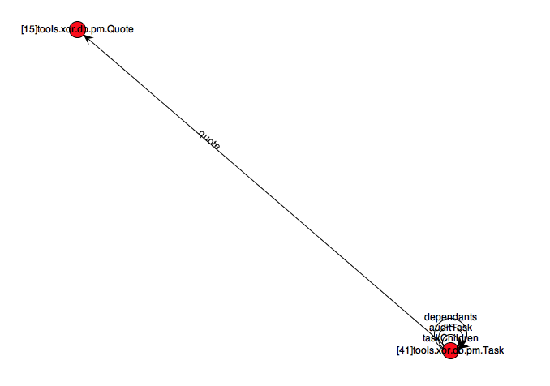
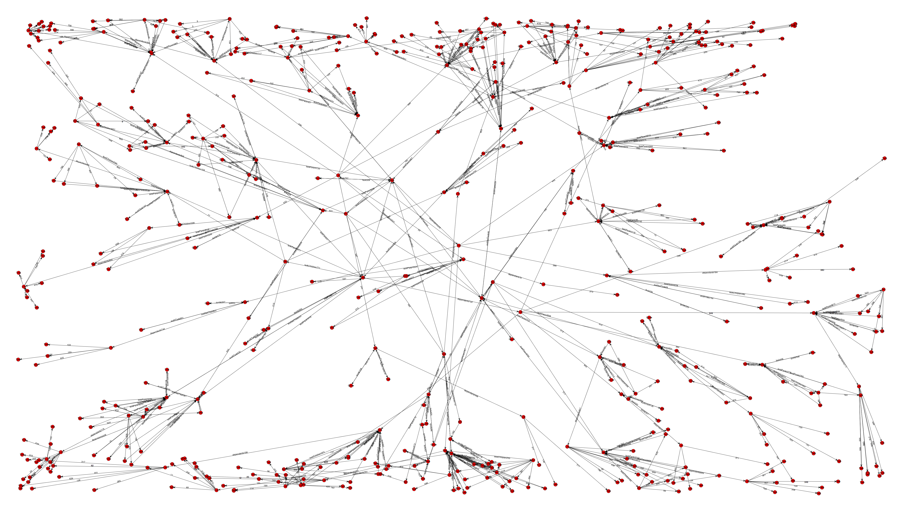

# Visualization

XOR can draw the types of an aggregate, an object graph, and the query tree of a view. The output format
follows the file name passed to `Settings.setGraphFileName`:

| Extension | Output |
| --- | --- |
| `.png` | An image, laid out with JUNG |
| `.dot` | Graphviz DOT |
| `.gml` | Graph Modelling Language |

## Type graph

The type graph (also called state graph) shows the types in an aggregate and the relationships between
them. The number before each type is its position in the topological order that XOR uses to save and
delete objects.



```java
DataModel das = aggregateManager.getDataModel();
Settings settings = das.settings().aggregate(Task.class).build();
TypeGraph sg = settings.getView().getTypeGraph((EntityType) settings.getEntityType());
settings.setGraphFileName("TaskStateGraph.png");
sg.generateVisual(settings);
```

## Object graph

The object graph shows how the objects of one aggregate instance are connected, which gives an idea of how
dense a generated graph is. When a graph file name is set, `create`, `update` and `read` draw the object
graph they processed.



```java
DataModel das = aggregateManager.getDataModel();
Settings settings = das.settings().aggregate(Task.class).build();
settings.setEntitySize(EntitySize.LARGE);
settings.setSparseness(0.01f);
TypeGraph sg = settings.getView().getTypeGraph((EntityType) settings.getEntityType());
JSONObject task = (JSONObject) sg.generateObjectGraph(settings);

settings.setGraphFileName("TaskGraph.png");
settings.setPostFlush(true);
aggregateManager.update(task, settings);
```

## Query tree

The `AggregateTree` built for a query can be exported to DOT, which shows how a view was split into
queries and how they are joined. See [Views](views.md#inspecting-the-query-tree).

```java
settings.getView().getAggregateTree(type).exportToDOT("taskchildrenmix.dot");
```

Previous: [Meta API](meta-api.md) | Next: [Development](development.md)
